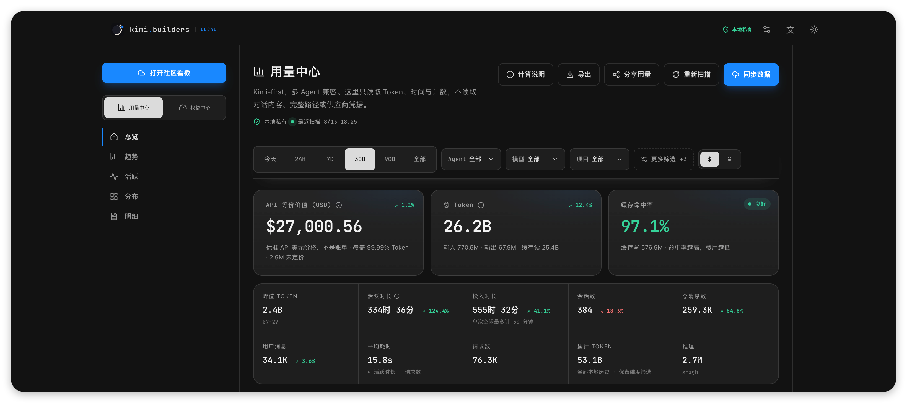
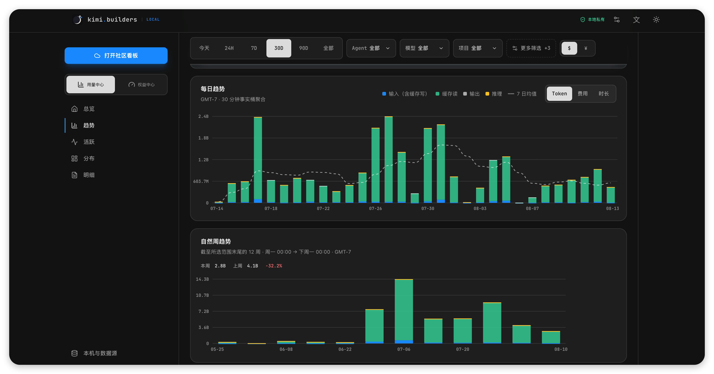
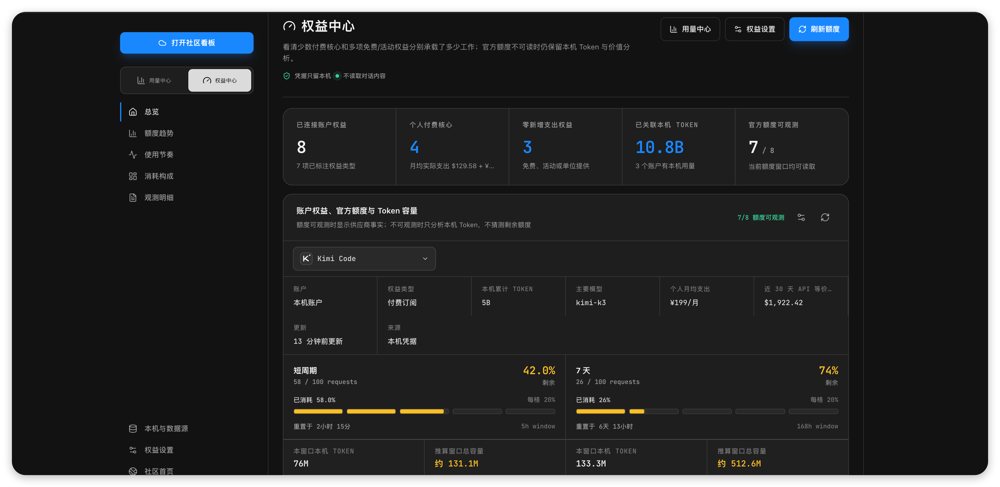
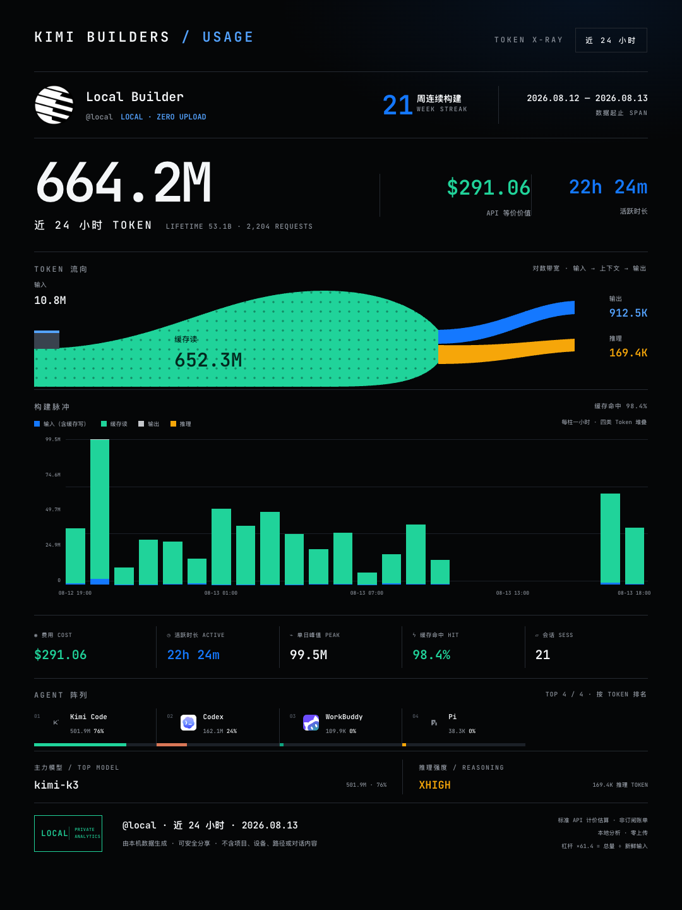
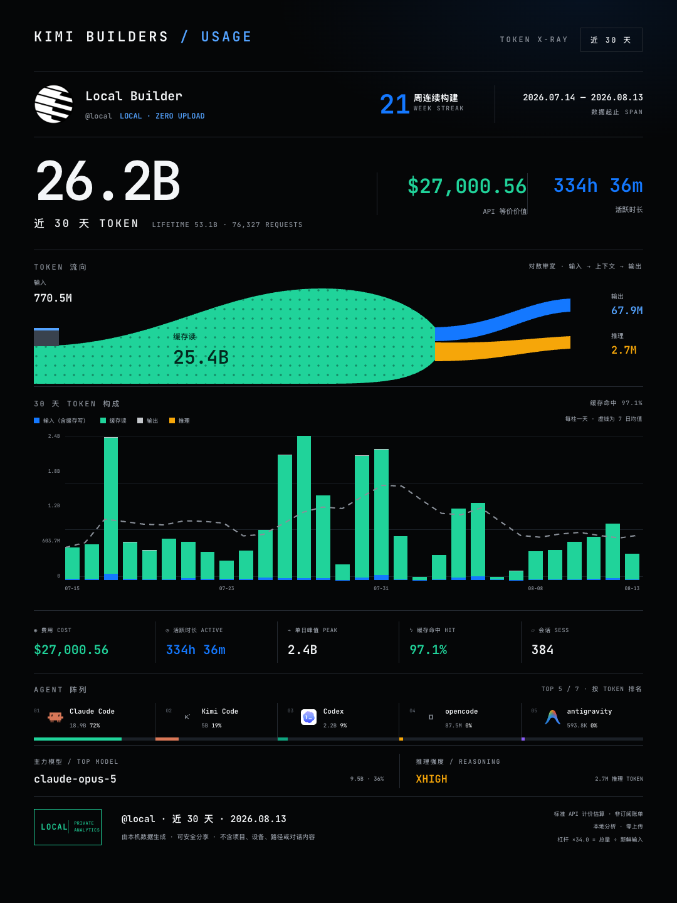

# Kimi Builders Usage

[简体中文](./README.md) · [English](./README.en.md)

[](https://www.npmjs.com/package/@kimi.builders/usage)
[](https://github.com/kimi-builders/usage/actions/workflows/ci.yml)
[](./LICENSE)

**Turn usage scattered across AI coding agents into one dashboard you can
actually analyze.**

Kimi Builders Usage reads logs that Kimi Code, Claude Code, Codex, OpenCode,
and other tools already keep on your computer. It combines tokens, standard-API
cost estimates, active time, models, projects, and subscription limits. The
local dashboard needs no account and stays offline by default; community sync
is a separate opt-in capability.

## Start in 3 minutes

[Node.js 20+](https://nodejs.org/) is required. No desktop app or global npm
install is needed:

```bash
npx @kimi.builders/usage@latest dashboard
```

On the first run:

1. npm asks to download `@kimi.builders/usage`; enter `y`. Installation does
   not scan or upload anything.
2. The dashboard detects available agents without immediately parsing all
   history. The first-run wizard asks for each agent's Off / Local only /
   Local + sync scope before scanning.
3. Review the local results, then optionally connect the community, choose sync
   sources, and enable background sync—all in the browser. Press `Ctrl+C` when
   finished.

> **Local is the default.** Opening the dashboard, pressing “Rescan”, and
> running `init` never upload usage; `init` only connects the device. Data from
> agents marked “Local + sync” is sent only when you explicitly run `sync`,
> press “Sync now”, install background sync, or use `init --sync`.

If an agent is missing from the dashboard, run this fully offline check first:

```bash
npx @kimi.builders/usage@latest inspect --dry-run
```

[Supported sources](#supported-local-usage-sources) ·
[Compatibility and known limitations](./docs/SOURCE_COMPATIBILITY.en.md) ·
[Troubleshooting](./SUPPORT.en.md)

### Let an agent do it for you

Copy this prompt into Codex, Claude Code, Kimi Code, or another agent that can
operate your local terminal. It will check the environment, inspect sources,
and start the dashboard:

```text
Read https://github.com/kimi-builders/usage/blob/main/README.en.md and follow its
current instructions to set up and launch Kimi Builders Usage on this computer.

Requirements:
1. Prefer the published package and npx; do not clone the repository or install
   anything globally unless there is a concrete reason.
2. Check `node --version` first. Node.js 20+ is required. If Node is missing or
   too old, explain the safest installation option for this OS and ask before
   installing or upgrading it.
3. Run `npx @kimi.builders/usage@latest inspect --dry-run` and summarize which
   Agent sources were detected. Do not expose full local paths, credentials,
   session identifiers, or conversation content in your response.
4. Run `npx @kimi.builders/usage@latest dashboard`, keep the process running,
   and open the authorized local dashboard URL. If automatic opening fails,
   tell me to copy the URL directly from my terminal; do not paste its capability
   token into chat.
5. This request is local-only. Do not run `init`, `sync`, `daemon`, enable quota
   providers, upload data, or change privacy settings unless I explicitly ask.
6. If a command fails, diagnose the real error, apply only the smallest safe
   fix, retry it, and finish with a short summary of what is running and how I
   can stop or restart it.
```

If you have decided to connect and sync the community, use this prompt instead.
The agent must pause for your device approval and must not install continuous
background sync on its own:

```text
Read these documents and follow their current instructions:
- https://github.com/kimi-builders/usage/blob/main/README.en.md
- https://github.com/kimi-builders/usage/blob/main/PRIVACY.md
- https://github.com/kimi-builders/usage/blob/main/NETWORK.md

Help me connect Kimi Builders Usage to kimi.builders and perform one sync.
Check Node.js 20+ and run the offline dry-run first. Then check the existing
connection with `npx @kimi.builders/usage@latest status`. If this device is not
connected, run `npx @kimi.builders/usage@latest init`, open the device approval
page, and pause so I can review and approve it. After approval, complete one
`npx @kimi.builders/usage@latest sync`, verify the final status, and launch the
local dashboard. Never print or copy API keys, cookies, credentials, full local
paths, session identifiers, or conversation content. Do not install, restart,
or remove the background daemon unless I explicitly approve that separate step.
```



## The short answers

| Question | Answer |
| --- | --- |
| Does it upload conversations or code? | No. The Token dashboard is local by default and does not read prompts, responses, or file contents. |
| Is a community account required? | No. Local usage and subscription analysis work independently. |
| Which agents are supported? | Eleven sources are auto-scanned; Cursor CSV is an explicit opt-in. See the matrix below. |
| Are the costs real bills? | No. They are standard-API estimates with visible pricing coverage and unpriced Tokens. |
| Which systems are supported? | macOS, Linux, and Windows with Node.js 20 or newer. |

## Choose what you need

**Local usage only:** you are already done. Do not run `init`.

**Subscription limits:** open “Benefit Center → Benefit settings” in the local
dashboard and enable only the providers you use. Limit queries are off by
default and never run merely because you opened the Token dashboard.

**Community or multi-device history:** press “Sync data” in the dashboard,
approve the device in your browser, and select which agents may sync. One-shot
sync, background sync, disconnect, and current-device cloud deletion are all
available in the dashboard. The CLI equivalent is:

```bash
npx @kimi.builders/usage@latest init
npx @kimi.builders/usage@latest sync
```

The community receives redacted aggregate records only. Project upload is off
by default. See [community sync](#connect-and-sync-the-community-optional) for
the complete flow.

## Three capabilities, three explicit boundaries

| Capability | Network by default | Account required | Data destination |
| --- | --- | --- | --- |
| Local Token dashboard | No | No | Local memory and browser only |
| Subscription limits | No; opt in per provider | Existing provider login or manual credential | Directly from this machine to the selected provider |
| Community sync | No; explicit connection required | kimi.builders | Redacted aggregates |

The cloud cannot pull files from your computer. See [NETWORK.md](./NETWORK.md)
for every network target and trigger.

## What you get

- A complete local dashboard for Today, 24H, 7D, 30D, 90D, and all history.
- One cross-agent contract for input, cache writes, cache reads, output,
  reasoning, requests, and sessions.
- Trends, natural-week comparisons, hourly activity, distributions, records,
  CSV/JSON exports, and share posters.
- Canonical model identity, reasoning effort, agent version, terminal, and OS
  facts when the source provides them.
- Standard API estimates with pricing coverage and unpriced-token disclosure,
  never presented as subscription bills.
- An optional Subscription Center for quota history, burn pace, token capacity,
  and subscription-value observations.

## More of the product

Every screenshot and poster below was generated from real local agent logs, not
mockups or seeded demo data.





Share posters exclude projects, devices, paths, and conversation content. They
also omit unreachable localhost QR codes. A custom avatar stays in the current
browser and is never uploaded to the community or a third party.

<p align="center">
  
  
</p>

**Project status:** public Beta. Stable sources are covered by cross-platform
fixtures and contract tests; sources with limited log-format evidence remain
explicitly labelled Beta. [Roadmap](./docs/ROADMAP.en.md) ·
[Release notes](./docs/RELEASE_NOTES_0.5.2.en.md) · [All docs](./docs/README.en.md)

## Run from source

```bash
git clone https://github.com/kimi-builders/usage.git
cd usage
npm run setup
npm run dev
```

`npm run setup` installs dashboard development dependencies once. `npm run dev`
starts the local API and Vite dashboard together; a second terminal is not
needed. Examples below use `npx @kimi.builders/usage …`; in a checkout, replace
that prefix with `node ./bin/kbu-usage.js …`.

To keep the browser closed:

```bash
npm run dev -- --no-open
```

## Local dashboard

```bash
npx @kimi.builders/usage dashboard
```

Every launch creates a new browser capability token. The server rejects
non-loopback peers, unexpected Host/Origin values, and unauthorized requests.
“Rescan” refreshes local data only; “Sync data” is a separate explicit action.

The local price catalog matches models by effective date, context tier, and
processing tier against standard API prices. Pricing coverage, assumed prices,
and unpriced tokens remain visible so an incomplete estimate cannot look like a
real invoice.

Session timing uses the same bounded-work definition across tools:

- active time counts assistant/tool gaps up to five minutes each;
- engaged time counts user-to-assistant/tool turn gaps up to 30 minutes each;
- a long-lived session ID cannot turn offline days into continuous work.

See [Local Snapshot v1](./docs/LOCAL_SNAPSHOT_V1.en.md) for fields and formulas.

## Supported local usage sources

| Agent | Status | Local source |
| --- | --- | --- |
| Kimi Code | Core | `~/.kimi-code` and legacy `~/.kimi` |
| Claude Code | Stable | `$CLAUDE_CONFIG_DIR` and project logs under `~/.claude*` |
| Codex | Stable | Current and archived sessions under `$CODEX_HOME` or `~/.codex` |
| OpenCode | Stable | SQLite database with legacy JSON fallback |
| Gemini CLI | Stable | JSONL/JSON sessions under `~/.gemini/tmp` |
| Antigravity | Stable | Offline SQLite stores from App 2.0 / `agy` CLI |
| GitHub Copilot CLI | Stable | Local CLI session logs |
| Roo Code | Stable | Local VS Code extension task data |
| Pi Coding Agent | Beta | JSONL sessions such as `~/.pi/agent/sessions`; format coverage is still growing |
| ZCode | Beta | Local SQLite session store; Node 20 may require a system `sqlite3` |
| WorkBuddy / CodeBuddy | Beta | Local WorkBuddy/CodeBuddy project session store |
| Cursor | Explicit opt-in | Usage CSV exported by Cursor Dashboard |

Sources are parsed independently. A missing, damaged, or changed source never
blocks another source and never clears that source's previous sync checkpoint.
These diagnostics stay offline:

```bash
npx @kimi.builders/usage inspect --dry-run
npx @kimi.builders/usage doctor
npx @kimi.builders/usage sources list
```

`doctor --json` is designed for issue reports. It excludes paths, projects,
models, session IDs, and row timestamps, but still contains aggregate counts and
redacted parser errors. Review it before sharing.

Cursor is currently the only usage source that first needs a data file. Beginners
can paste and verify its full CSV path during first-run setup or under **Local &
sources** in the dashboard; terminal users can also run:

```bash
npx @kimi.builders/usage sources enable cursor --csv /path/to/usage.csv
npx @kimi.builders/usage sources disable cursor
```

Local Cursor source settings do not require a community account or `init`. Dashboard
verification and the CLI command only store the local CSV path; they neither access
the network nor start community sync. See the
[source compatibility matrix](./docs/SOURCE_COMPATIBILITY.en.md) for maturity,
limitations, and verification evidence.

## Subscription limits (optional)

Subscription limits are not local token consumption. They are off by default.
The Collector contacts a provider only after you enable it, using an existing
local login or a credential source you choose.

Current integrations cover Codex, Claude Code, Kimi Code, Cursor, GitHub
Copilot, Antigravity, DeepSeek, OpenCode Go, Qoder, Warp, and JetBrains AI.
Depending on the provider, setup can use local detection, an
environment variable, or macOS Keychain. Trae has no stable independently
verifiable personal-limit interface, so it is labeled unavailable rather than
showing invented data.

Google retired the individual Gemini CLI OAuth benefit surface, so it is no
longer a Subscription Center provider. Existing Gemini CLI local Token history
remains available through the offline parser. Antigravity first reuses an
already-running, signed-in Antigravity or `agy` loopback service to read the
Gemini and Claude/GPT five-hour and weekly pools. Quota checks never start or
terminate the user's process. Explicit Antigravity OAuth or CodexBar credentials
are used only when no usable local service is available.

DeepSeek uses an explicitly configured API key with the public balance endpoint.
It shows per-currency total, topped-up, and granted money balances and never
converts money into a Token quota. A separate local model-family view groups
DeepSeek model records across Agents; those records may overlap their Agent
benefit view, do not prove use of the configured API-key account, and are
deduplicated in portfolio totals.

Kimi Code appears first by default. Grab the handle to drag any enabled provider
into place with a mouse or touch; the order is stored locally and reused for both
quota tabs and provider requests.

Every successful refresh stores one sanitized quota snapshot locally. The
Subscription Center aligns changes in the same provider window with local Token
usage to show burn pace, projected utilization at reset, 30-day actual cost per
million Tokens, standard-API-equivalent value, and model concentration. Every
observation identifies its evidence window. It never changes a plan automatically
or presents observed utilization as a provider-published fixed Token cap.

Quota credentials and responses never enter token snapshots, exports, or
community sync. Manual secrets are not stored in the normal `config.json`.
Sanitized history is retained for at most 400 days and downsampled as it ages; it
also stays out of exports, posters, and community sync. Provider endpoints and
authentication boundaries are in [NETWORK.md](./NETWORK.md), and locally stored
fields are documented in [PRIVACY.md](./PRIVACY.md).

## Connect and sync the community (optional)

Connect the device once (or do the whole flow in the dashboard's “Sync data”
dialog):

```bash
npx @kimi.builders/usage init
```

The terminal shows a device code and opens the community approval page. After
approval, the device receives an independently revocable `kbu_` key. `init`
does not upload usage by itself; confirm source scope in the dashboard or with
`sources set`, then sync. Project upload is off by default; when disabled, the
JSON payload has no `project` field.

The connection code is valid for 10 minutes and lives only in the current
Collector/local-dashboard process; it is never written to browser storage or a
config file. Refreshing the dashboard can resume the request, while stopping or
restarting the process requires a new code. The device key is delivered once
after approval and can be safely revoked from the local dashboard at any time.

Each agent has three independent modes:

```bash
npx @kimi.builders/usage sources list
npx @kimi.builders/usage sources set codex off
npx @kimi.builders/usage sources set kimi-code local
npx @kimi.builders/usage sources set claude-code private
```

`off` does not scan, `local` stays in on-device analysis, and `private` may
upload to your community account. Changing mode never silently deletes existing
cloud history. Current-device cloud deletion is a separate confirmed dashboard
action. Newly supported agents default to local only and never join sync
automatically; account-level community settings separately control visibility.

Run one sync:

```bash
npx @kimi.builders/usage sync
```

Or install continuous per-user sync:

```bash
npx @kimi.builders/usage daemon install --interval 15
npx @kimi.builders/usage daemon status
npx @kimi.builders/usage daemon restart
npx @kimi.builders/usage daemon uninstall
```

The service needs no administrator privileges. It uses `launchd` on macOS,
user `systemd` on Linux, and Task Scheduler on Windows. It works only while the
device is awake and online. After upgrading the Collector, run `daemon restart`
so the service records the new package path.

Sync uses incremental checkpoints, per-source failure isolation, and a
concurrency lock. Repeated runs do not duplicate counts. If you delete a
device's remote history, reconnect as a different device, or the dashboard
cannot prove that the local checkpoint belongs to the current community
device, review every agent marked `private`, then explicitly replay it:

```bash
npx @kimi.builders/usage sync --full
```

`--full` re-uploads normalized aggregates only for `private` sources. It does
not include `off` or `local` sources and does not delete community data. The
checkpoint is bound to an irreversible fingerprint of the community target
and device credential, so a reconnect cannot silently inherit another
device's “already uploaded” state. The dashboard shows the same scope and asks
for a second confirmation.

## Command reference

| Command | Purpose | Network |
| --- | --- | --- |
| `dashboard [--no-open] [--port N]` | Start the local dashboard | No by default |
| `inspect --dry-run` | Show roots and parser results | No |
| `doctor [--json]` | Produce a redacted compatibility report | No |
| `sources list` | Show local usage-source status | No |
| `sources set <agent> off\|local\|private` | Set one agent's scan and sync scope | No |
| `init [--api-url URL] [--sync]` | Connect a community device; no upload by default, `--sync` explicitly keeps connect-then-sync behavior | Yes |
| `sync [--full]` | Upload changed aggregates; `--full` explicitly replays allowed sources | Yes |
| `daemon install/status/restart/uninstall` | Manage background sync | See NETWORK |
| `summary [--days N]` | Read the connected account's hosted summary | Yes |
| `status` | Show local connection and checkpoint state | No |
| `reset --local` | Clear local sync checkpoints | No |

Local configuration and checkpoint state live under
`~/.kimi-builders/usage/`. Sensitive config files use mode `0600` on POSIX.

## Privacy promise

The Collector **never uploads**:

- prompts, responses, reasoning text, or tool results;
- full paths, file contents, repository remotes, or environment dumps;
- raw session IDs;
- provider cookies, OAuth tokens, API keys, or quota responses;
- local dashboard filters, navigation, or interaction events.

Session IDs are transformed with HMAC-SHA-256 and a random installation-local
salt, so different devices cannot correlate the result. The local snapshot may
keep a project-directory basename for private analysis; community sync removes
the project field by default.

Further reading:

- [Development roadmap](./docs/ROADMAP.en.md)
- [Contributing](./CONTRIBUTING.en.md)
- [Support and troubleshooting](./SUPPORT.en.md)
- [Privacy boundaries](./PRIVACY.md)
- [Per-command network inventory](./NETWORK.md)
- [Threat model](./THREAT_MODEL.md)
- [Security reporting and release requirements](./SECURITY.md)
- [Local/community product boundary](./docs/PRODUCT_BOUNDARY.en.md)

## Development and verification

```bash
npm run setup
npm run dev
```

Before a commit:

```bash
npm test
npm run dashboard:build
npm run dashboard:test
```

Before a release:

```bash
npm run release:check
```

This runs Collector tests, builds and tests the dashboard, and uses
`npm pack --dry-run` to show the exact package contents. `npm publish` runs the
same gate through `prepublishOnly`, but the check command never publishes by
itself. See [PUBLISHING.md](./PUBLISHING.md).

Tests redirect every source, config, and state path to temporary fixtures. They
do not read the developer's real HOME.

Before submitting parser, quota-provider, sync-protocol, or UI changes, follow
the relevant privacy and test checklist in [CONTRIBUTING.en.md](./CONTRIBUTING.en.md).
Do not open a public Issue for a vulnerability; use the private reporting path
documented in [SUPPORT.en.md](./SUPPORT.en.md).

## License and acknowledgements

The complete project is released under the [MIT License](./LICENSE). Original
project contributions are © 2026 `kimi.builders contributors`.

Parts of the initial parser layer and related tests were adapted from the
MIT-licensed [`@vibe-cafe/vibe-usage`](https://github.com/vibe-cafe/vibe-usage).
The Vibe Usage desktop clients were direct product references, and parts of the
provider-specific quota protocols and parsers were adapted from CodexBar. Code
adaptations, product references, and bundled dependencies are recorded
separately and do not imply joint ownership, maintenance, or endorsement. See
[NOTICE](./NOTICE) for the complete provenance record.
